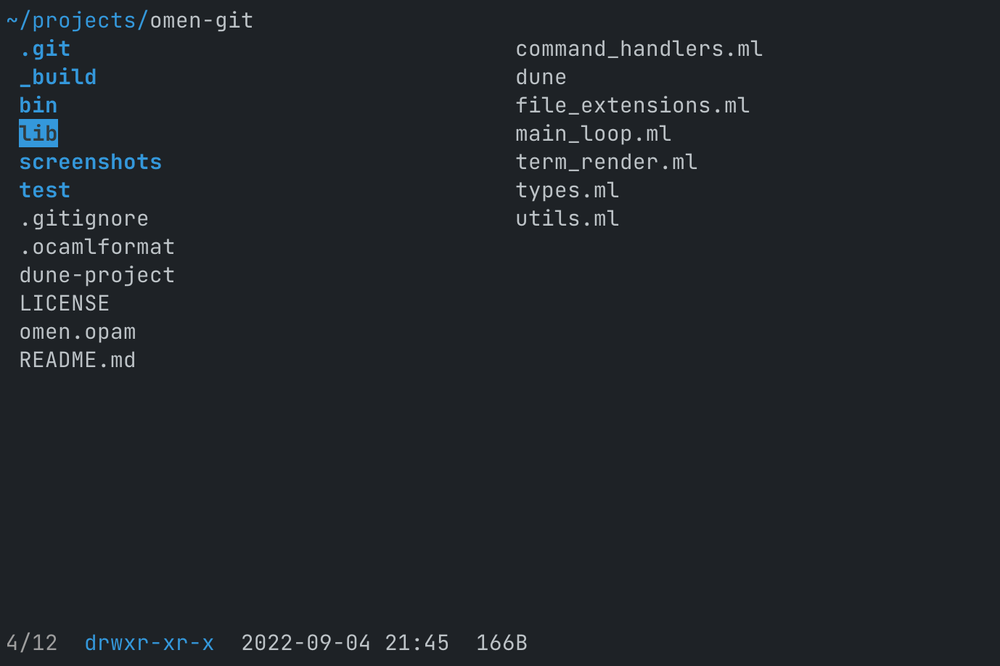
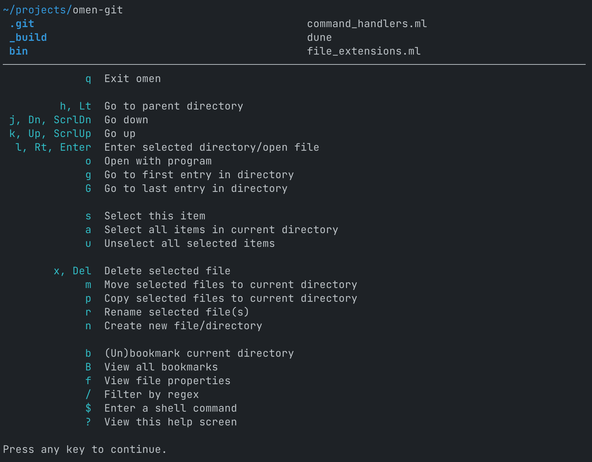
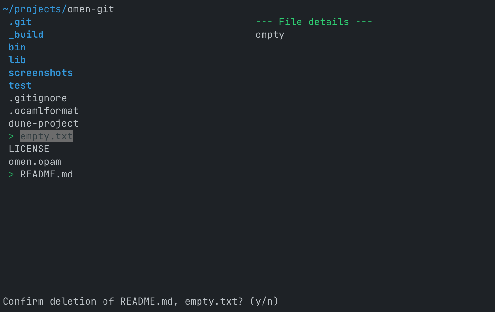
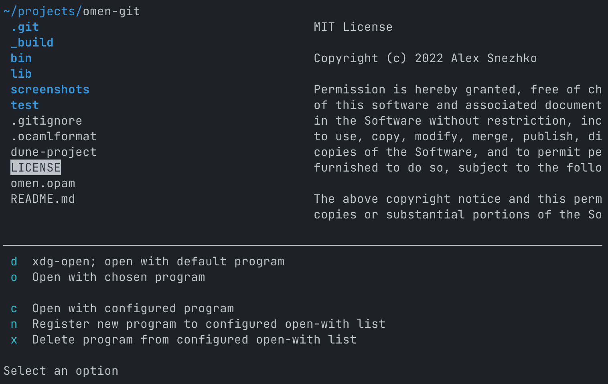
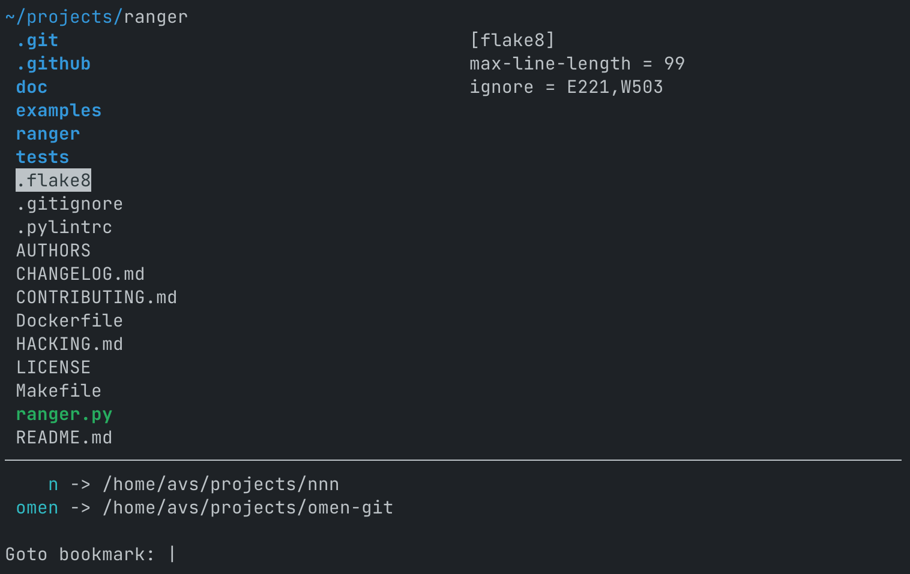
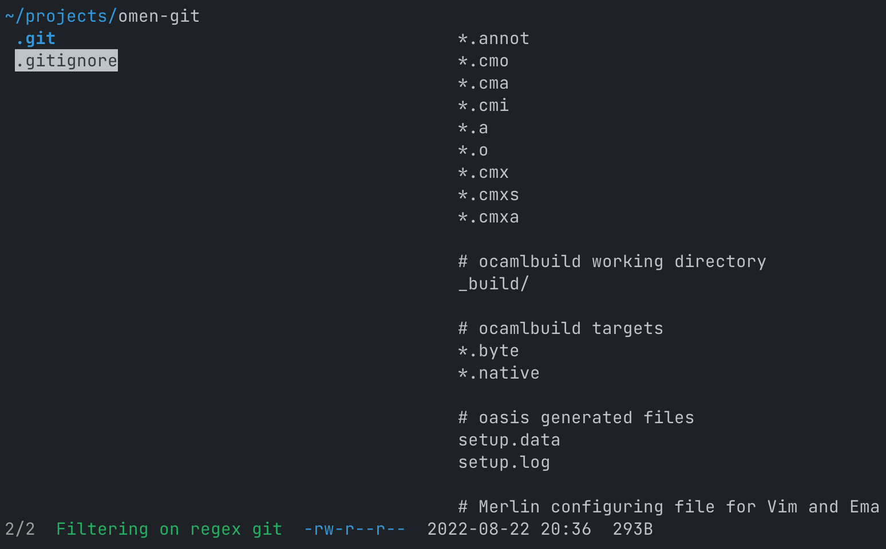
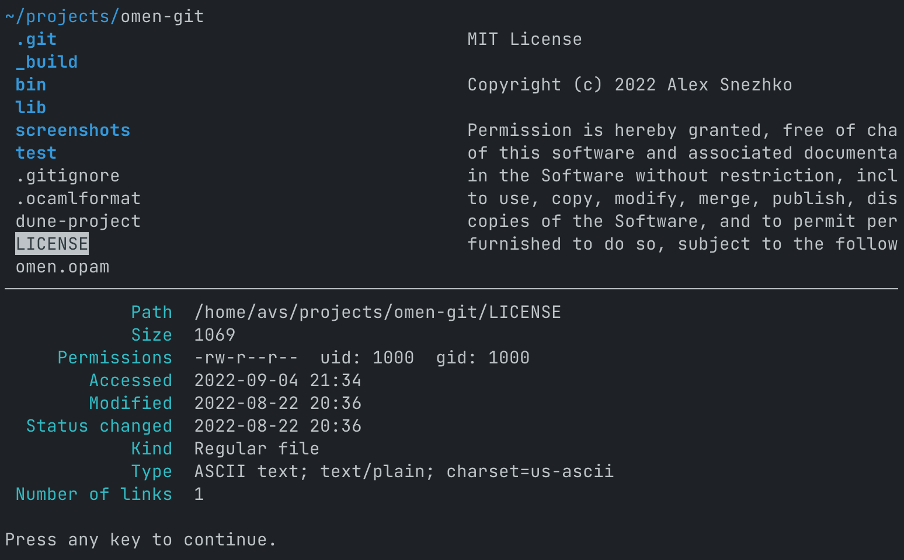

# omen
A simple TUI file manager for Linux/Unix systems that exists mostly because I wanted to try out OCaml. It is somewhat of a mashup of [nnn](https://github.com/jarun/nnn) and [ranger](https://github.com/ranger/ranger) functionally, with a few changes to match my personal taste.

## Overview
An overview of some of omen's features
- 2-pane interface; left: contents of directory; right: preview of selected item
- Opening programs with program of choice (and saving commonly used programs for quick access)
- Standard file manipulations: moving, renaming, copying, deleting, creating new files
- Bookmarking directories for quick access
- Filtering directory contents

Omen is controlled using the keyboard mostly, and has vim-like keybinds. `?` opens the help dialog, where all of omen's commands are displayed. For batch operations, files can be 'selected' to then be operated on. For example, selecting several files in one directory, moving into another directory and then pasting will copy all of the files into that directory.

## Installation
First, make sure you have installed `opam` and `dune` to be able to build omen's source into an executable. 
```
git clone https://github.com/alex-snezhko/omen.git
cd omen

# omen only has notty as a dependency, so this is sufficient to get deps
opam install notty

# build omen into an executable
dune build --profile=release

# (optional) put omen somewhere in your path
sudo cp _build/default/bin/main.exe /usr/bin/omen
```

## Screenshots









